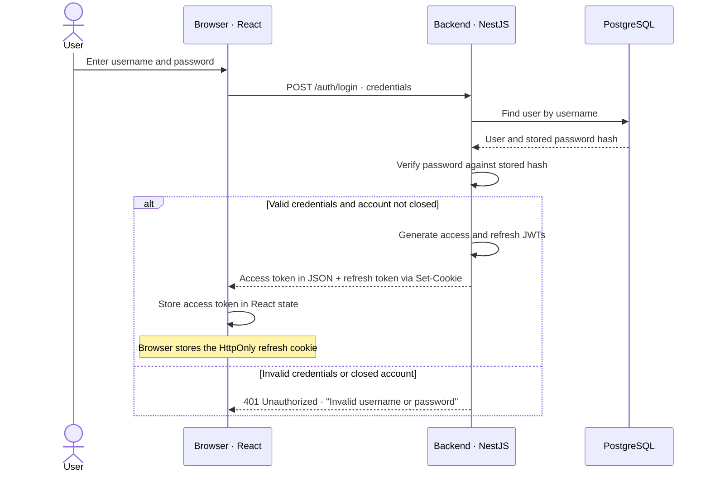
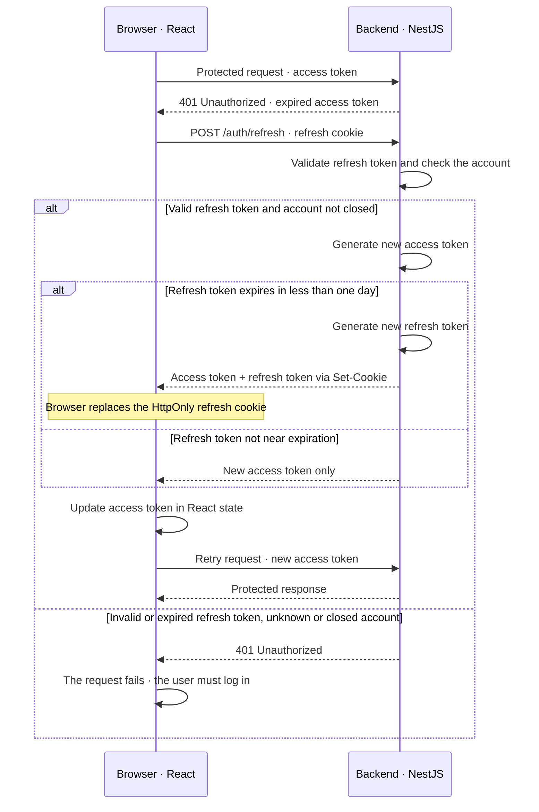
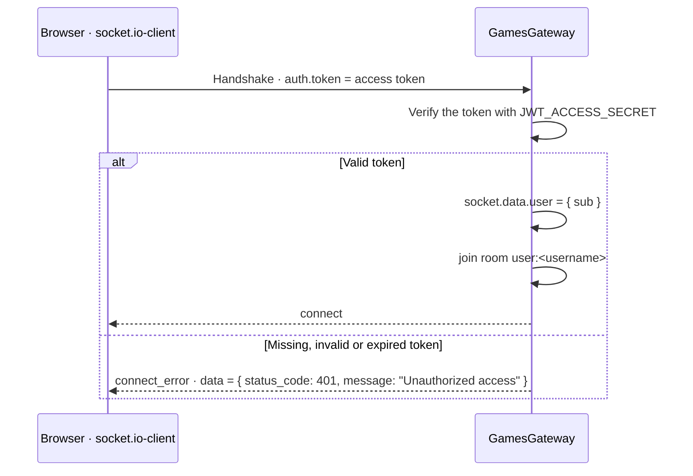

# Authentication and Authorization

The backend authenticates users and issues two JWT tokens:
a short-lived access token and a long-lived refresh token.

Token validation is stateless: the backend verifies the signature and the expiration
without keeping a server-side login session.
The payload of both tokens is `{ sub: <username> }`.

## Signup

`POST /auth/signup` with `{ username, email, password }` creates the user.
The password is hashed with Argon2 (argon2id, the default of the `argon2` package)
and is never stored or returned in plain text: the Prisma client omits `passwordhash`
from every query unless a query asks for it explicitly.

The input is not validated yet (no length or format rules on the server).
Any failure, including a username or email already in use, answers `400 Unable to create user`.

## Login Flow

A closed account fails with the same message as a wrong username, so the answer does not reveal
whether an account exists.

## Tokens

| Token         | Lifetime   | Secret               | Storage                         | Purpose                                                  |
| ------------- | ---------- | -------------------- | ------------------------------- | -------------------------------------------------------- |
| Access token  | 15 minutes | `JWT_ACCESS_SECRET`  | React state (memory)            | Authenticate HTTP requests and the WebSocket connection. |
| Refresh token | 2 days     | `JWT_REFRESH_SECRET` | `refresh_token` HttpOnly cookie | Obtain a new access token without logging in again.      |

The access token is sent in the `Authorization: Bearer <token>` header.

The refresh cookie is set with `httpOnly`, `sameSite: "lax"`, `secure: false`
(it must become `true` in production, with HTTPS), path `/` and a maximum age of 2 days.
Frontend JavaScript cannot read it; the browser attaches it to requests made with
`credentials: "include"`. CORS allows credentials only from `FRONTEND_URL`.

## Access-Token Renewal

Because React state is held in memory, reloading the page clears the
access token. The frontend calls `/auth/refresh` at start to restore authentication
while the refresh cookie remains valid.

## Logout and closed accounts

- `POST /auth/logout` clears the refresh cookie (same options used to set it).
  It is not protected: it works even with an expired access token.
- `POST /profile/me/close` sets `closedAt` on the user and clears the cookie too.
  From then on login and refresh are refused.

Tokens are not revoked on the server: an access token already issued stays valid until it expires
(at most 15 minutes), also after logout, password change or account closure.
A refresh token stays valid after logout or a password change until it expires,
but it stops working as soon as the account is closed.

## WebSocket Authentication

The WebSocket connection is authenticated once, during the handshake,
by a socket.io middleware registered in `GamesGateway.afterInit`.

- After the handshake the socket is trusted until it disconnects: a connection opened with a valid token
  stays open after the token expires.
- socket.io does not retry by itself after a middleware error: the client must refresh the token
  and call `connect()` again.
- Every event handler takes the username from `socket.data.user.sub`, never from the payload.

## Frontend session handling

All of this lives in `frontend/src/context/AuthContext.tsx` and `frontend/src/api/client.ts`.

1. **Restore**: on mount the `AuthProvider` calls `POST /auth/refresh` and then `GET /auth/me`.
   Until it finishes the application shows "Loading session…"; on failure the user is a guest.
2. **Single-flight refresh**: `refresh()` keeps the pending promise in a ref, so concurrent callers
   share one request.
3. **Authenticated fetch**: `useAuthenticatedFetch()` returns `authenticatedFetch` bound to the current token.
   It sends the bearer token; on a 401 it refreshes once and retries once. If the refresh fails the
   error reaches the caller.
4. **Socket**: when the access token changes the provider sets `socket.auth = { token }` and reconnects;
   when the token becomes null it disconnects. On `connect_error` it is meant to refresh once and,
   if the refresh fails, clear the session. The handler must recognise the backend format above
   (`data.status_code === 401`).
5. **Logout**: `POST /auth/logout`, then token and username are set to null, which also closes the socket.

## Authorization

The backend validates the access token before allowing access to protected
endpoints (`JwtAuthGuard`). Every endpoint is protected except `/health`, signup, login, refresh and logout.

It also checks permissions where required. For example:

- a game can be created only by one of its two players;
- only the player whose turn it is can move, and only the two players can resign;
- account settings (`/profile/me/...`) always act on the user of the token, and the sensitive ones
  require the current password (`403 Wrong password` otherwise).

Anybody logged in can read any game (`GET /games/:id`, `game.join`) and any profile:
this is what allows spectators.
