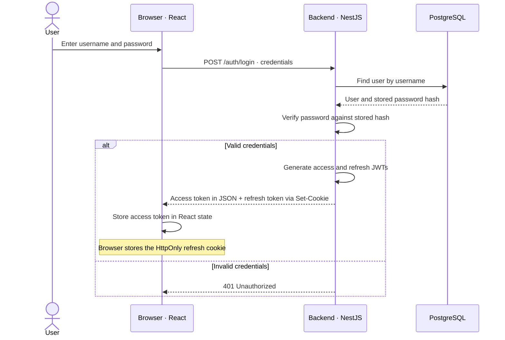
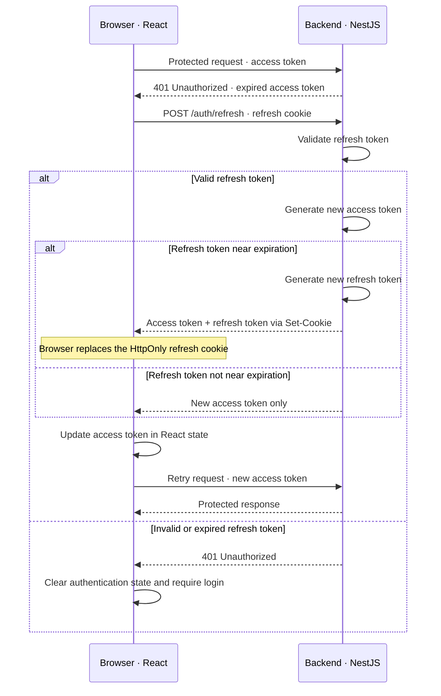

# Authentication and Authorization

The backend authenticates users and issues two JWT tokens:
a short-lived access token and a long-lived refresh token.

Access-token validation is stateless: the backend verifies the token
without maintaining a server-side login session.

## Login Flow

## Tokens

| Token | Storage | Purpose |
|---|---|---|
| Access token | React state | Authenticate requests to protected endpoints. |
| Refresh token | HttpOnly browser cookie | Obtain a new access token without logging in again. |

The access token is sent in the `Authorization: Bearer <token>` header.

The refresh cookie cannot be read by frontend JavaScript.
The browser attaches it to matching requests when credentials are enabled.

## Access-Token Renewal

Because React state is held in memory, reloading the page clears the
access token. The frontend can call `/auth/refresh` to restore authentication
while the refresh cookie remains valid.

## Authorization

The backend validates the access token before allowing access to protected
endpoints. It also checks permissions where required—for example, whether
the authenticated user is a player in a game and is allowed to make a move.

