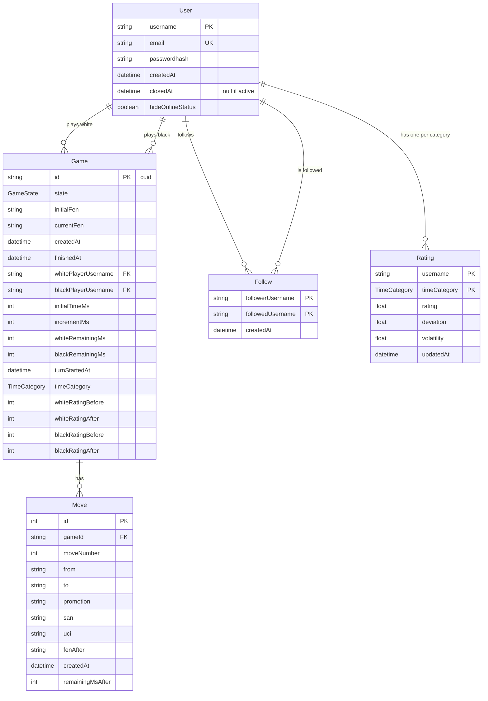

# Database

PostgreSQL 18, accessed only by the backend through Prisma 6.
The schema is `backend/prisma/schema.prisma`; Prisma reads the connection from `DATABASE_URL`
(`backend/prisma.config.ts`).

## Model



### User

- `username` is the primary key and cannot be changed; the JWT `sub` is the username.
- `passwordhash` (Argon2) is omitted by default by the Prisma client (`omit` in `PrismaService`):
  a query that needs it must ask for it with `omit: { passwordhash: false }` or `select`.
- Accounts are never deleted: closing an account sets `closedAt`.

### Game

- `state`: enum `GameState`, default `ready` (see [game-lifecycle.md](game-lifecycle.md)).
- `initialFen` is the starting position, `currentFen` the current one; they are always updated
  in the same transaction as the move that changes them.
- The player columns are nullable foreign keys to `User.username` (`ON DELETE SET NULL`).
- Clock columns are all null for a game without a clock.
- `timeCategory` is stored at creation, default `unlimited`.
- The rating columns are null until the game is rated; `whiteRatingAfter` not null means "already rated".
- Indexes: `(whitePlayerUsername, createdAt)` and `(blackPlayerUsername, createdAt)`, for the profile history.

### Move

- `moveNumber` counts half-moves from 1 (1 = first white move, 2 = first black move).
- Unique `(gameId, moveNumber)`: it keeps the moves ordered and makes two concurrent moves on the same
  position impossible.
- `san` is the history that is replayed to rebuild a game; `uci` is the unambiguous form (e.g. `e7e8q`).
- `gameId` references `Game.id` with `ON DELETE RESTRICT`: delete the moves before their game.

### Follow

- One row per "follower follows followed", primary key on the pair; following is one-way.
- Index on `followedUsername`, to find the followers of a user.
- Deleted with the users (`ON DELETE CASCADE`).

### Rating

- One row per user and `timeCategory`, created at the first rated game of that category;
  a missing row means the defaults (1500, 350, 0.06), which must stay equal to `rating/rating.constants.ts`.

### Enums

| Enum           | Values                                                                                                                                                                                                                                                                  |
| -------------- | ----------------------------------------------------------------------------------------------------------------------------------------------------------------------------------------------------------------------------------------------------------------------- |
| `GameState`    | `ready`, `running`, `aborted`, `white_win`, `black_win`, `white_resigned`, `black_resigned`, `white_timeout`, `black_timeout`, `draw`, `stalemate`, `insufficient_material`, `threefold_repetition`, `fivefold_repetition`, `fifty_move_rule`, `seventy_five_move_rule` |
| `TimeCategory` | `bullet`, `blitz`, `rapid`, `classical`, `unlimited`                                                                                                                                                                                                                    |

## Migrations

Migrations are in `backend/prisma/migrations` and are applied in order by `prisma migrate deploy`
at every start of the backend.

| Migration                              | Change                                                                                                                               | Destroys data               |
| -------------------------------------- | ------------------------------------------------------------------------------------------------------------------------------------ | --------------------------- |
| `20260915224109_init_game_and_move`    | `Game` and `Move` tables                                                                                                             | –                           |
| `20260917122706_add_user`              | `User` table                                                                                                                         | no                          |
| `20260924201606_update_game_model`     | `Game.id` becomes a text cuid; `running` and `result` removed; player usernames added                                                | yes, on existing games      |
| `20260926142835_game_state_enum`       | `state` recreated as the `GameState` enum, default `ready`                                                                           | yes, the old `state` values |
| `20260928230612_add_clock`             | Nullable clock columns on `Game`, `remainingMsAfter` on `Move`                                                                       | no                          |
| `20261007193030_profile_follow_rating` | `TimeCategory`, rating columns on `Game`, `createdAt`/`closedAt`/`hideOnlineStatus` on `User`, `Follow` and `Rating` tables, indexes | no                          |

### Changing the schema

1. Edit `schema.prisma`.
2. Create and apply the migration; this also regenerates the client:

   ```bash
   docker compose exec backend npx prisma migrate dev --name <short_name>
   ```

3. Read the generated SQL before committing: Prisma writes a warning comment at the top when the migration loses data.
4. Commit the schema and the new migration folder together. Never edit a migration that is already on `main`.

`migration_lock.toml` must not change; if git shows it as modified after `migrate dev`, it is usually only
a line-ending difference: restore it with `git restore`.

## Prisma client

- The generator is `prisma-client` with output `backend/src/generated/prisma`, imported as
  `../generated/prisma/client`, `../generated/prisma/enums` and `../generated/prisma/models`.
- The generated folder is in `.gitignore` and the start script does not generate it:
  after cloning, and after every pull that changes the schema, run

  ```bash
  docker compose exec backend npx prisma generate
  ```

  With an outdated client the backend still starts (`ts-node --transpile-only` does not type-check),
  but new enums or columns are missing at runtime.
- `binaryTargets` includes the Alpine (musl) engines for x64 and arm64, used by the container.
- `PrismaService` (`backend/src/database/`) extends the client, connects on module init and
  disconnects on shutdown; it is the only way the application reaches the database.
  Raw SQL is not used.

## Transactions

- Moves are applied in an interactive transaction (`$transaction(async (tx) => ...)`):
  the move and the game update are committed together or not at all.
- Ratings are saved in a transaction that also claims the game.
- Single-row state changes from other paths (resignation, countdown start, time out) use a conditional
  `updateMany` instead of a transaction (see [game-lifecycle.md](game-lifecycle.md#concurrency)).
