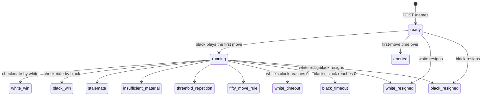
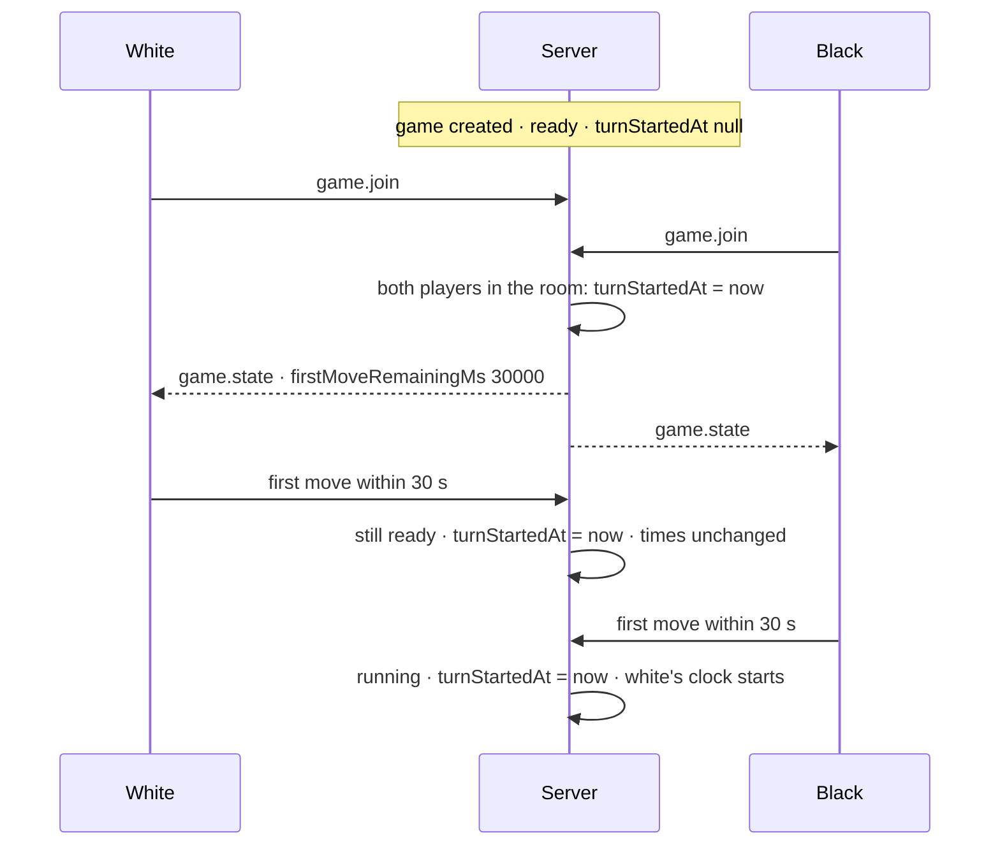

# Game Lifecycle

This document describes how a game is created, played and closed, how the clock works
and how ratings are updated. The rules live in:

| File                                         | Responsibility                                                |
| -------------------------------------------- | ------------------------------------------------------------- |
| `backend/src/games/games.service.ts`         | Creation, moves, resignation, first-move countdown, `GameDto` |
| `backend/src/chess/chess.service.ts`         | chess.js wrapper: legality, FEN, SAN, UCI, end conditions     |
| `backend/src/clock/clock.service.ts`         | Pure clock arithmetic (no database)                           |
| `backend/src/clock/time-control.ts`          | Time category and label of a time control                     |
| `backend/src/games/games.timeout.service.ts` | Cron that closes games whose time ran out                     |
| `backend/src/rating/`                        | Glicko-2 ratings                                              |

## States

`Game.state` is the `GameState` enum. The values are lowercase because Prisma returns the name of
the value: the database, the API and the frontend see the same string.

| State                                                                           | Meaning                                                                                               | Rated |
| ------------------------------------------------------------------------------- | ----------------------------------------------------------------------------------------------------- | ----- |
| `ready`                                                                         | Created; no move, or only the first white move                                                        | –     |
| `running`                                                                       | Both players have moved at least once                                                                 | –     |
| `aborted`                                                                       | A first move was not played in time                                                                   | no    |
| `white_win`, `black_win`                                                        | Checkmate                                                                                             | yes   |
| `white_resigned`, `black_resigned`                                              | The named side resigned                                                                               | yes   |
| `white_timeout`, `black_timeout`                                                | The named side ran out of time (always a loss)                                                        | yes   |
| `stalemate`, `insufficient_material`, `threefold_repetition`, `fifty_move_rule` | Draws detected by chess.js                                                                            | yes   |
| `draw`                                                                          | Agreed draw: reserved, no code assigns it yet (no draw offers)                                        | yes   |
| `fivefold_repetition`, `seventy_five_move_rule`                                 | Reserved: unreachable, because chess.js already ends the game at threefold repetition and at 50 moves | yes   |

Moves and resignations are accepted only in `ready` and `running`.
Every other state is final and has `finishedAt` set.

## Creation

`POST /games` (see [api.md](api.md)) checks the players and the time control, then:

- draws the colors at random (`crypto.randomInt`);
- stores the standard initial position as `initialFen` and `currentFen`;
- stores `initialTimeMs` and `incrementMs` (both null: no clock), and the `timeCategory`;
- sets both remaining times to the initial time; when the initial time is 0 (e.g. `0+1`)
  they start from the increment instead, otherwise the first player would lose immediately;
- leaves `turnStartedAt` null: the clock has not started;
- notifies both players with `game.created`.

## Moves

`GamesService.applyMove` runs in one database transaction:

1. load the game; `404` if missing, `409` if it is not `ready` or `running`;
2. check that the caller is the player whose turn it is (`403`);
3. load the move history: the whole game is replayed from `initialFen`, so chess.js knows every
   earlier position and can detect threefold repetition;
4. check the clock (below); if the time is over, close the game and return it without applying the move;
5. apply the move with chess.js (`409` if illegal);
6. create the `Move` row and update the game (`currentFen`, `state`, `finishedAt`, clock fields);
7. after the commit, if the game ended, update the ratings.

The new state after a move is decided by the first true condition:
checkmate > stalemate > insufficient material > threefold repetition > fifty-move rule >
`ready` (still in move 1, i.e. after the first white move) > `running`.

## Clock

All times are in milliseconds, in the database and in the API.
The server is authoritative: elapsed time is always computed from server timestamps,
and the clients only show an approximation that they re-synchronize at each `game.state`.

### Stored values

| Field                                  | Meaning                                                                                           |
| -------------------------------------- | ------------------------------------------------------------------------------------------------- |
| `initialTimeMs`, `incrementMs`         | The time control; null for a game without a clock                                                 |
| `whiteRemainingMs`, `blackRemainingMs` | Time left at the **start** of the current turn: the value does not decrease while a player thinks |
| `turnStartedAt`                        | When the current turn (or the first-move window) started; null while nothing is counting          |
| `Move.remainingMsAfter`                | Time of the mover after the move, increment included                                              |

### First moves (`ready` phase)

Like on Lichess, the clocks start only after both players have moved once.
Each first move has instead a fixed window of **30 seconds** (`ClockService.firstMoveAllowedMs`),
for every time control.

- The window starts only when both players are in the game room, so a player who has not opened the game yet
  cannot lose it. If white moves before black has joined, black's window starts when black joins.
- In the `ready` phase no time is subtracted and no increment is added.
- If a window expires the game becomes `aborted` and is not rated.
- `GameDto.firstMoveRemainingMs` is the time left in the window, computed when the DTO is built.

### Running phase

At each move of the side to move:

- `elapsed = now − turnStartedAt`;
- if `remaining − elapsed ≤ 0` the player has lost on time: the move is not applied,
  the game becomes `white_timeout` or `black_timeout` and the loser's time is set to 0;
- otherwise the new time is `remaining − elapsed + increment`, and `turnStartedAt = now` for the opponent.

In `GameDto` the time of the side to move is the live value (`remaining − elapsed`, never below 0),
so a client that joins or reconnects in the middle of a turn shows the right time.

### Time out without a move

`GameTimeoutService.checkExpiredGames` runs every second (`@nestjs/schedule`, `waitForCompletion`).
It reads the `ready` and `running` games with `turnStartedAt` set and, for each one whose
first-move window or clock is over:

- closes it with an `updateMany` that matches the values just read (`state`, `turnStartedAt`, `finishedAt: null`):
  if a move or another backend instance changed the game in the meantime, nothing is updated;
- updates the ratings and broadcasts `game.state` to the game room.

Games without a clock are never closed by the server: they stay `ready` or `running` until a result or a resignation.

### Time categories

`describeTimeControl` (`clock/time-control.ts`) is the only place that decides the category,
from the estimated duration `initial + 40 × increment` (in seconds), with the Lichess limits:

| Category    | Estimated duration    |
| ----------- | --------------------- |
| `bullet`    | below 180 s (3 min)   |
| `blitz`     | below 480 s (8 min)   |
| `rapid`     | below 1500 s (25 min) |
| `classical` | 1500 s or more        |
| `unlimited` | no clock              |

The category is stored at creation (`Game.timeCategory`), so old games keep their category
if the limits change. The label (`3+2`, `0.5+0`, `∞`: minutes + seconds) is computed when needed.

## Resignation

`game.resign` is accepted from either player while the game is `ready` or `running`
(also before the first move). The update is conditional on the state, so a resignation that
arrives after the end of the game answers `409 The game is not running.`
The game gets `finishedAt` and `turnStartedAt: null`, and it is rated.

## Concurrency

- Two moves for the same game cannot both be stored: `Move` has a unique constraint on
  `(gameId, moveNumber)`. The second transaction fails with Prisma `P2002`, is rolled back
  and answers `409`, and the client can retry against the new state.
- Resignation, first-move countdown, time out and rating use conditional `updateMany` calls
  (optimistic concurrency): the update happens only if the row still has the expected values,
  and `count === 0` means somebody else got there first.
- No row is locked and no distributed lock is used.

## Ratings

Every finished game, except `aborted`, updates the Glicko-2 rating of both players
in the category of the game (`unlimited` included). Defaults and parameters are in `rating/rating.constants.ts`:

| Value                                 |                 |
| ------------------------------------- | --------------- |
| Initial rating, deviation, volatility | 1500, 350, 0.06 |
| τ (volatility change)                 | 0.75            |
| Deviation limits                      | 45 – 350        |
| Provisional when deviation is above   | 110             |

- `RatingService.rateGame` is called after a move that ends the game, after a resignation and by the time-out cron.
- Each game is its own rating period, as on Lichess.
- The game is claimed with an `updateMany` on `whiteRatingAfter: null` inside the same transaction that saves
  the new ratings, so a game is rated only once, even if `rateGame` runs twice or on two instances.
- The rounded ratings before and after the game are stored on `Game` and shown in the profile history.
- A failure while rating is logged and does not undo the end of the game.
- The implementation (`rating/glicko2.ts`) follows Glickman's paper and reproduces its example
  (1464.05 / 151.52 / 0.059996).
