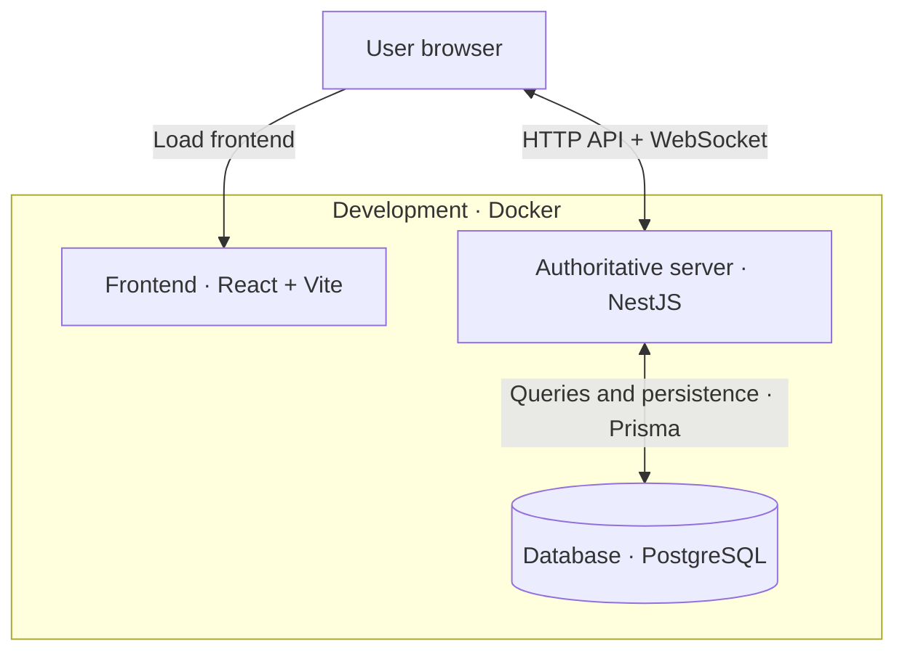

# Application Infrastructure

This document describes the current infrastructure of Salici.
It evolves alongside the application.

## Development Environment

The application runs in three Docker containers:

## Responsibilities

| Container | Responsibility |
|---|---|
| Frontend | Serves the React application, which runs in the user's browser. Displays the board, clocks, and other interface elements. |
| Authoritative server | Handles authentication, validates moves, manages game state and clocks, and broadcasts game updates. |
| Database | Persists users, games, and moves. Accessible through the backend. |

## Communication

- The browser loads the React application from the frontend container.
- The React application uses HTTP for API requests and WebSocket for live game events.
- The backend is the source of truth for game state and uses Prisma to access PostgreSQL.
- The frontend never connects directly to the database.